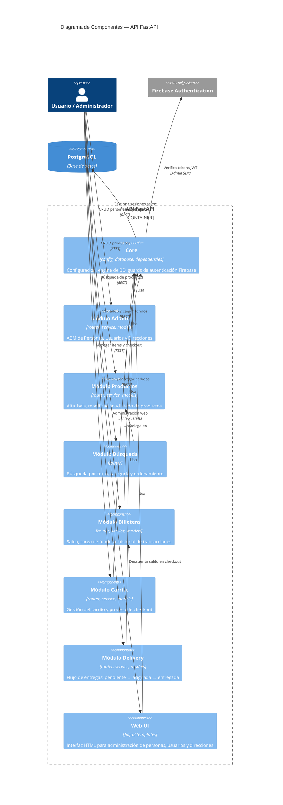

# C4 - Diagrama de Componentes

```mermaid
C4Component
    title Diagrama de Componentes — API FastAPI

    Person(usuario, "Usuario / Administrador")
    System_Ext(firebase, "Firebase Authentication")
    ContainerDb(db, "PostgreSQL", "Base de datos")

    Container_Boundary(api, "API FastAPI") {
        Component(core, "Core", "config, database, dependencies", "Configuración, engine de BD, guards de autenticación Firebase")
        Component(admin, "Módulo Admin", "router, service, models", "ABM de Personas, Usuarios y Direcciones")
        Component(productos, "Módulo Productos", "router, service, models", "Alta, baja, modificación y listado de productos")
        Component(busqueda, "Módulo Búsqueda", "router", "Búsqueda por texto, categoría y ordenamiento")
        Component(billetera, "Módulo Billetera", "router, service, models", "Saldo, carga de fondos e historial de transacciones")
        Component(carrito, "Módulo Carrito", "router, service, models", "Gestión del carrito y proceso de checkout")
        Component(delivery, "Módulo Delivery", "router, service, models", "Flujo de entregas: pendiente → asignada → entregada")
        Component(web, "Web UI", "Jinja2 templates", "Interfaz HTML para administración de personas, usuarios y direcciones")
    }

    Rel(usuario, admin, "CRUD personas/usuarios/dirs", "REST")
    Rel(usuario, productos, "CRUD productos", "REST")
    Rel(usuario, busqueda, "Búsqueda de productos", "REST")
    Rel(usuario, billetera, "Ver saldo y cargar fondos", "REST")
    Rel(usuario, carrito, "Agregar items y checkout", "REST")
    Rel(usuario, delivery, "Tomar y entregar pedidos", "REST")
    Rel(usuario, web, "Administración web", "HTTP / HTML")

    Rel(admin, core, "Usa")
    Rel(productos, core, "Usa")
    Rel(busqueda, productos, "Delega en")
    Rel(billetera, core, "Usa")
    Rel(carrito, core, "Usa")
    Rel(carrito, billetera, "Descuenta saldo en checkout")
    Rel(delivery, core, "Usa")
    Rel(web, core, "Usa")

    Rel(core, firebase, "Verifica tokens JWT", "Admin SDK")
    Rel(core, db, "Gestiona sesiones async", "asyncpg")
```
