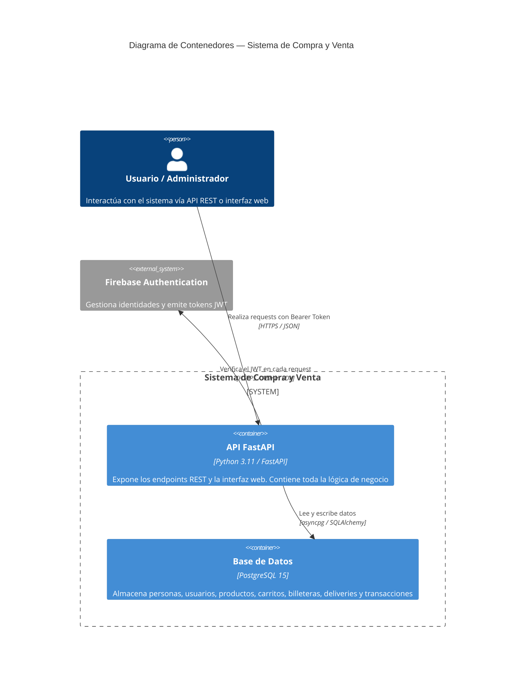

# C4 - Diagrama de Contenedores

```mermaid
C4Container
    title Diagrama de Contenedores — Sistema de Compra y Venta

    Person(usuario, "Usuario / Administrador", "Interactúa con el sistema vía API REST o interfaz web")

    System_Ext(firebase, "Firebase Authentication", "Gestiona identidades y emite tokens JWT")

    System_Boundary(sistema, "Sistema de Compra y Venta") {
        Container(api, "API FastAPI", "Python 3.11 / FastAPI", "Expone los endpoints REST y la interfaz web. Contiene toda la lógica de negocio")
        Container(db, "Base de Datos", "PostgreSQL 15", "Almacena personas, usuarios, productos, carritos, billeteras, deliveries y transacciones")
    }

    Rel(usuario, api, "Realiza requests con Bearer Token", "HTTPS / JSON")
    Rel(api, firebase, "Verifica el JWT en cada request", "HTTPS / Admin SDK")
    Rel(api, db, "Lee y escribe datos", "asyncpg / SQLAlchemy")
```
