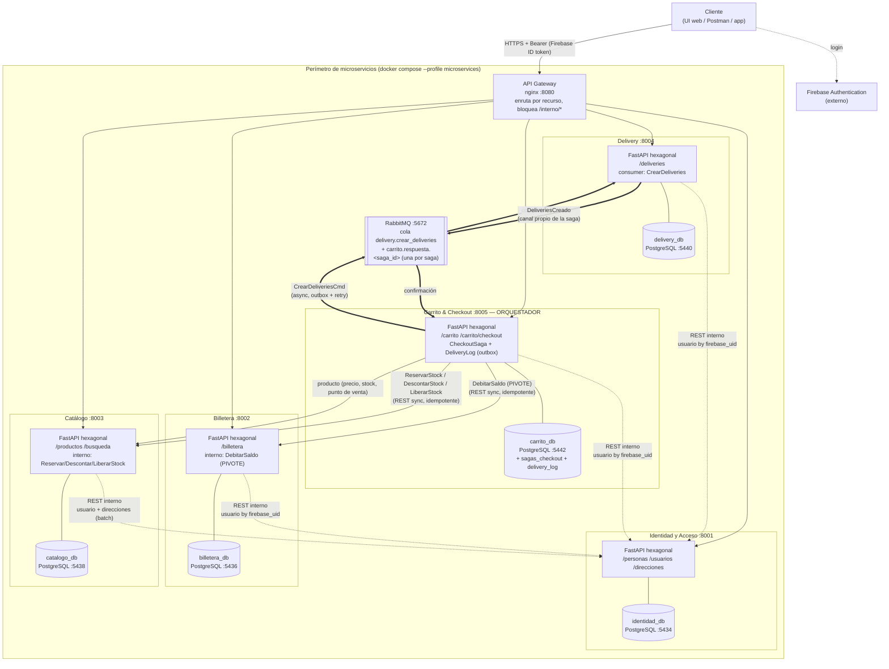

# C4 — Contenedores (arquitectura de microservicios)

Diagrama de contenedores del sistema migrado: 5 microservicios hexagonales con
database-per-service, un API Gateway como única puerta de entrada, y RabbitMQ
solo para el tramo asincrónico de la saga (CrearDeliveries).

## Decisiones reflejadas

| Decisión | Dónde se ve |
|---|---|
| Database-per-service | 5 PostgreSQL independientes; FKs cross-service son UUID sin constraint |
| Gateway único | nginx :8080; `/interno/*` devuelve 403 desde afuera |
| Sync salvo delivery | Flechas sólidas = REST sincrónico; dobles = RabbitMQ |
| Pivote = DebitarSaldo | Billetera; si falla, Carrito compensa con LiberarStock |
| Canales de respuesta múltiples | Una cola `carrito.respuesta.<saga_id>` por saga, no una cola general |
| Outbox | `delivery_log` en la BD de Carrito, con worker de retry |

> El monolito original sigue en el repo (`app/`, puerto 8000) como base de comparación
> del TP y porque la UI web (Jinja2) y `notificaciones` quedaron fuera del alcance de
> la migración (plan §2).
