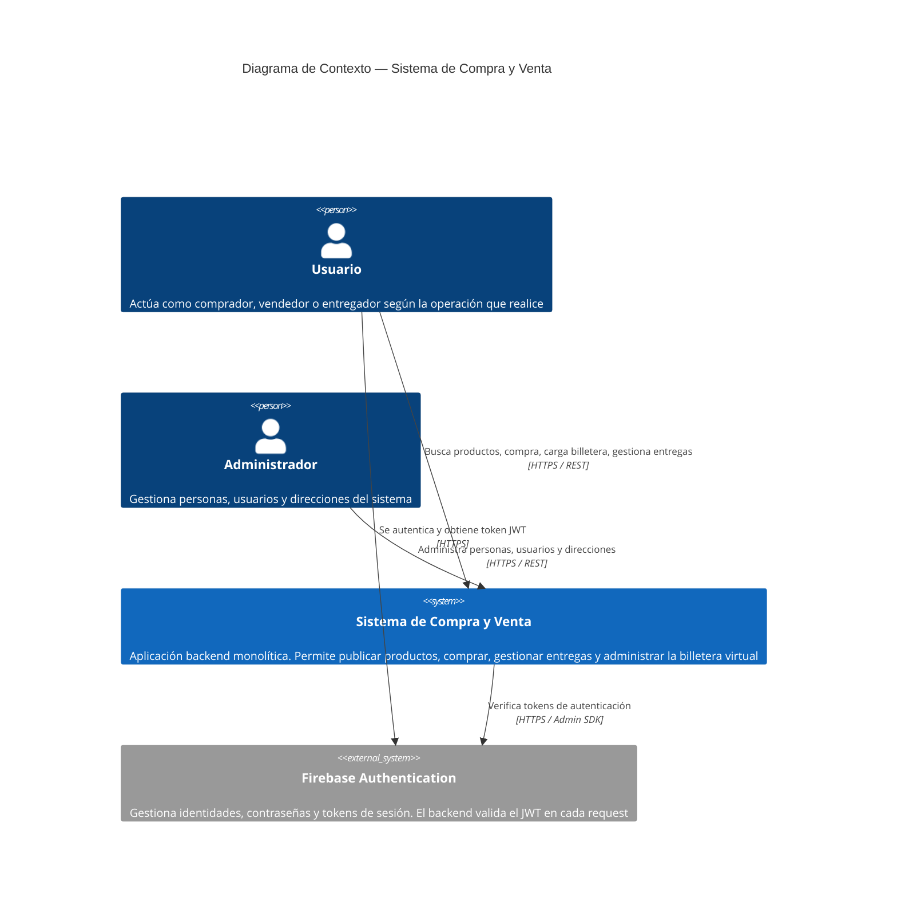

# C4 - Diagrama de Contexto

```mermaid
C4Context
    title Diagrama de Contexto — Sistema de Compra y Venta

    Person(usuario, "Usuario", "Actúa como comprador, vendedor o entregador según la operación que realice")
    Person(admin, "Administrador", "Gestiona personas, usuarios y direcciones del sistema")

    System(sistema, "Sistema de Compra y Venta", "Aplicación backend monolítica. Permite publicar productos, comprar, gestionar entregas y administrar la billetera virtual")

    System_Ext(firebase, "Firebase Authentication", "Gestiona identidades, contraseñas y tokens de sesión. El backend valida el JWT en cada request")

    Rel(usuario, sistema, "Busca productos, compra, carga billetera, gestiona entregas", "HTTPS / REST")
    Rel(admin, sistema, "Administra personas, usuarios y direcciones", "HTTPS / REST")
    Rel(sistema, firebase, "Verifica tokens de autenticación", "HTTPS / Admin SDK")
    Rel(usuario, firebase, "Se autentica y obtiene token JWT", "HTTPS")
```
