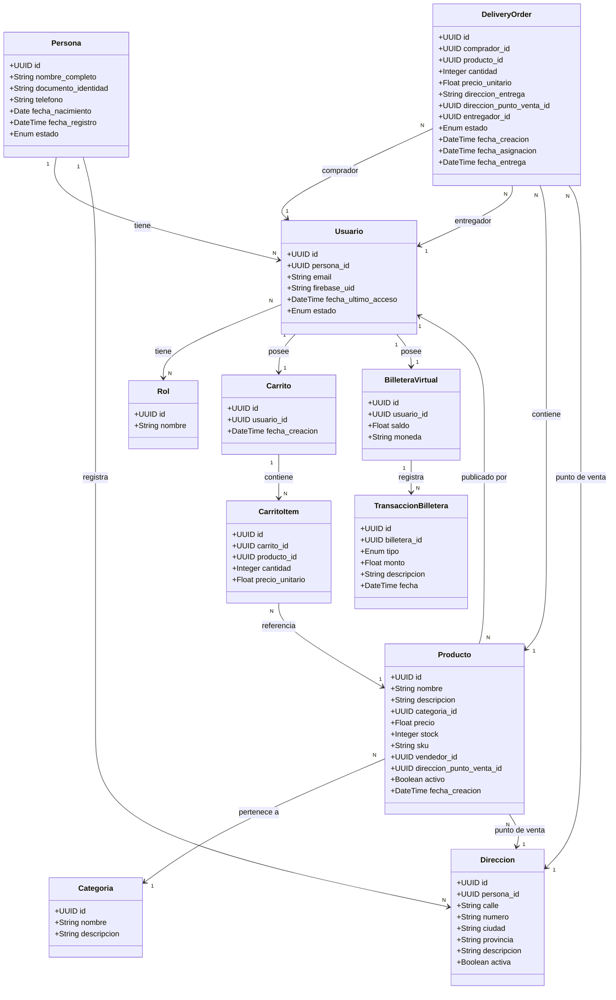

# UML - Modelo de Datos

```mermaid
classDiagram
    class Persona {
        +UUID id
        +String nombre_completo
        +String documento_identidad
        +String telefono
        +Date fecha_nacimiento
        +DateTime fecha_registro
        +Enum estado
    }

    class Usuario {
        +UUID id
        +UUID persona_id
        +String email
        +String firebase_uid
        +DateTime fecha_ultimo_acceso
        +Enum estado
    }

    class Rol {
        +UUID id
        +String nombre
    }

    class Direccion {
        +UUID id
        +UUID persona_id
        +String calle
        +String numero
        +String ciudad
        +String provincia
        +String descripcion
        +Boolean activa
    }

    class Categoria {
        +UUID id
        +String nombre
        +String descripcion
    }

    class Producto {
        +UUID id
        +String nombre
        +String descripcion
        +UUID categoria_id
        +Float precio
        +Integer stock
        +String sku
        +UUID vendedor_id
        +UUID direccion_punto_venta_id
        +Boolean activo
        +DateTime fecha_creacion
    }

    class Carrito {
        +UUID id
        +UUID usuario_id
        +DateTime fecha_creacion
    }

    class CarritoItem {
        +UUID id
        +UUID carrito_id
        +UUID producto_id
        +Integer cantidad
        +Float precio_unitario
    }

    class BilleteraVirtual {
        +UUID id
        +UUID usuario_id
        +Float saldo
        +String moneda
    }

    class TransaccionBilletera {
        +UUID id
        +UUID billetera_id
        +Enum tipo
        +Float monto
        +String descripcion
        +DateTime fecha
    }

    class DeliveryOrder {
        +UUID id
        +UUID comprador_id
        +UUID producto_id
        +Integer cantidad
        +Float precio_unitario
        +String direccion_entrega
        +UUID direccion_punto_venta_id
        +UUID entregador_id
        +Enum estado
        +DateTime fecha_creacion
        +DateTime fecha_asignacion
        +DateTime fecha_entrega
    }

    Persona "1" --> "N" Usuario : tiene
    Persona "1" --> "N" Direccion : registra
    Usuario "N" --> "N" Rol : tiene
    Usuario "1" --> "1" Carrito : posee
    Usuario "1" --> "1" BilleteraVirtual : posee
    Carrito "1" --> "N" CarritoItem : contiene
    CarritoItem "N" --> "1" Producto : referencia
    BilleteraVirtual "1" --> "N" TransaccionBilletera : registra
    Producto "N" --> "1" Categoria : pertenece a
    Producto "N" --> "1" Usuario : publicado por
    Producto "N" --> "1" Direccion : punto de venta
    DeliveryOrder "N" --> "1" Usuario : comprador
    DeliveryOrder "N" --> "1" Usuario : entregador
    DeliveryOrder "N" --> "1" Producto : contiene
    DeliveryOrder "N" --> "1" Direccion : punto de venta
```
