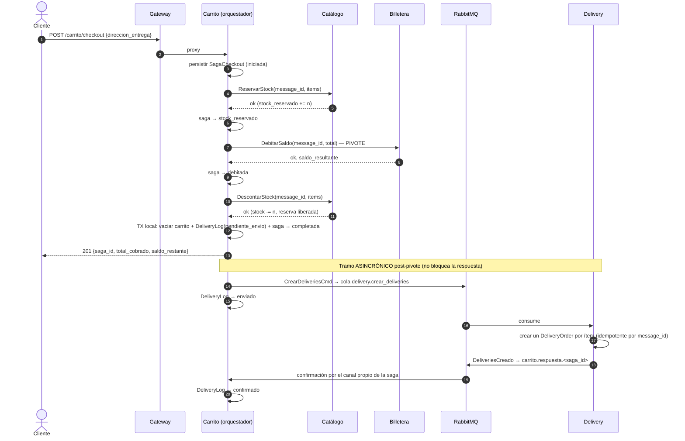
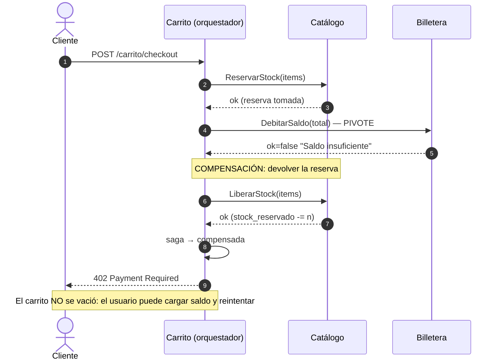

# UML — Secuencia del checkout distribuido (CheckoutSaga)

Reemplazo del checkout ACID del monolito por una saga por orquestación.
Todos los comandos llevan `message_id` determinístico (`uuid5(saga_id, paso)`) y
los participantes son idempotentes: cualquier reintento es seguro.

## Camino feliz



## Camino de fallo: pivote rechazado → compensación



## Broker caído: retry desde el log (outbox)

```mermaid
sequenceDiagram
    autonumber
    participant CA as Carrito (orquestador)
    participant LOG as delivery_log (BD Carrito)
    participant MQ as RabbitMQ
    participant D as Delivery

    Note over CA,LOG: El checkout ya respondió 201; el log quedó escrito en la misma TX
    CA--xMQ: publicar CrearDeliveriesCmd (broker caído)
    CA->>LOG: estado = pendiente_envio, intentos++
    loop Worker de retry (cada 30s)
        CA->>LOG: leer no-confirmados
        CA->>MQ: re-publicar con el MISMO message_id
        MQ->>D: consume
        D->>D: idempotente: si ya procesó ese message_id,<br/>devuelve los mismos delivery_ids sin duplicar
        D->>MQ: DeliveriesCreado → carrito.respuesta.<saga_id>
        MQ->>CA: confirmación
        CA->>LOG: estado = confirmado (el retry deja de levantarlo)
    end
```

## Estados

| Saga (`sagas_checkout`) | Log (`delivery_log`) |
|---|---|
| iniciada → stock_reservado → debitada → stock_descontado → **completada** | pendiente_envio → enviado → **confirmado** |
| iniciada → **fallida** (reserva rechazada, HTTP 409 — sin efectos) | |
| stock_reservado → **compensada** (pivote falló → LiberarStock, HTTP 402) | |
