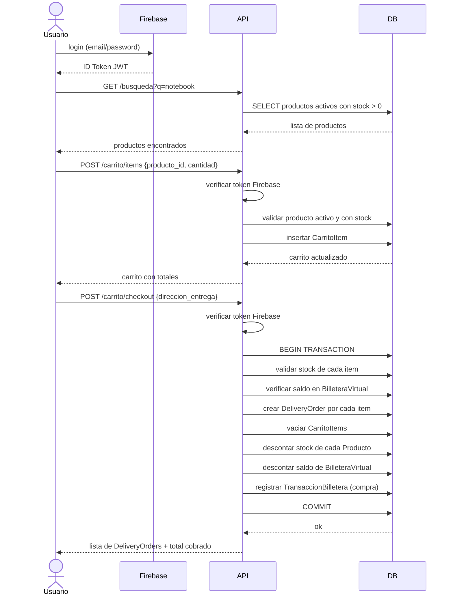

# UML - Secuencia: Proceso de Compra

```mermaid
sequenceDiagram
    actor Usuario
    participant Firebase
    participant API
    participant DB

    Usuario->>Firebase: login (email/password)
    Firebase-->>Usuario: ID Token JWT

    Usuario->>API: GET /busqueda?q=notebook
    API->>DB: SELECT productos activos con stock > 0
    DB-->>API: lista de productos
    API-->>Usuario: productos encontrados

    Usuario->>API: POST /carrito/items {producto_id, cantidad}
    API->>API: verificar token Firebase
    API->>DB: validar producto activo y con stock
    API->>DB: insertar CarritoItem
    DB-->>API: carrito actualizado
    API-->>Usuario: carrito con totales

    Usuario->>API: POST /carrito/checkout {direccion_entrega}
    API->>API: verificar token Firebase
    API->>DB: BEGIN TRANSACTION
    API->>DB: validar stock de cada item
    API->>DB: verificar saldo en BilleteraVirtual
    API->>DB: crear DeliveryOrder por cada item
    API->>DB: vaciar CarritoItems
    API->>DB: descontar stock de cada Producto
    API->>DB: descontar saldo de BilleteraVirtual
    API->>DB: registrar TransaccionBilletera (compra)
    API->>DB: COMMIT
    DB-->>API: ok
    API-->>Usuario: lista de DeliveryOrders + total cobrado
```
