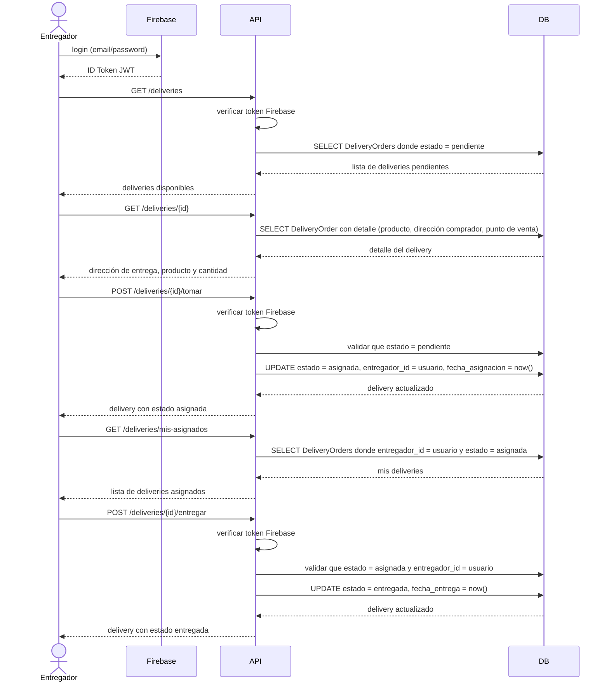

# UML - Secuencia: Proceso de Entrega

```mermaid
sequenceDiagram
    actor Entregador
    participant Firebase
    participant API
    participant DB

    Entregador->>Firebase: login (email/password)
    Firebase-->>Entregador: ID Token JWT

    Entregador->>API: GET /deliveries
    API->>API: verificar token Firebase
    API->>DB: SELECT DeliveryOrders donde estado = pendiente
    DB-->>API: lista de deliveries pendientes
    API-->>Entregador: deliveries disponibles

    Entregador->>API: GET /deliveries/{id}
    API->>DB: SELECT DeliveryOrder con detalle (producto, dirección comprador, punto de venta)
    DB-->>API: detalle del delivery
    API-->>Entregador: dirección de entrega, producto y cantidad

    Entregador->>API: POST /deliveries/{id}/tomar
    API->>API: verificar token Firebase
    API->>DB: validar que estado = pendiente
    API->>DB: UPDATE estado = asignada, entregador_id = usuario, fecha_asignacion = now()
    DB-->>API: delivery actualizado
    API-->>Entregador: delivery con estado asignada

    Entregador->>API: GET /deliveries/mis-asignados
    API->>DB: SELECT DeliveryOrders donde entregador_id = usuario y estado = asignada
    DB-->>API: mis deliveries
    API-->>Entregador: lista de deliveries asignados

    Entregador->>API: POST /deliveries/{id}/entregar
    API->>API: verificar token Firebase
    API->>DB: validar que estado = asignada y entregador_id = usuario
    API->>DB: UPDATE estado = entregada, fecha_entrega = now()
    DB-->>API: delivery actualizado
    API-->>Entregador: delivery con estado entregada
```
